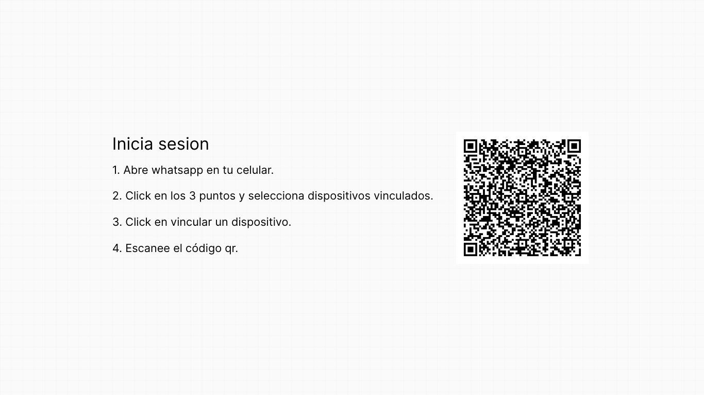
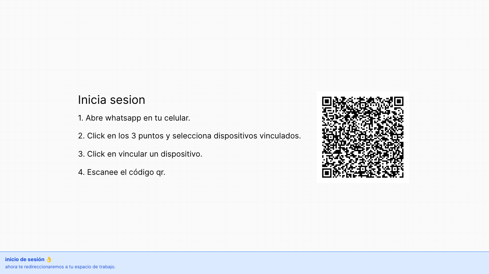
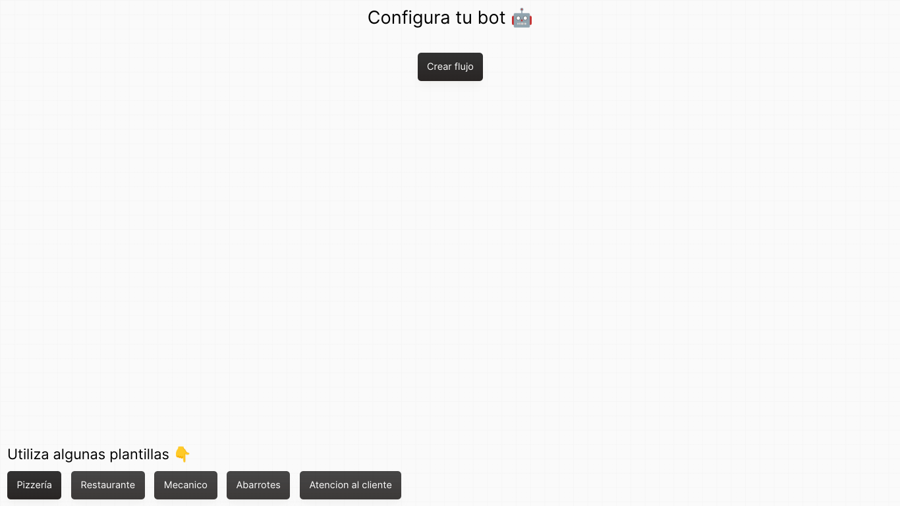
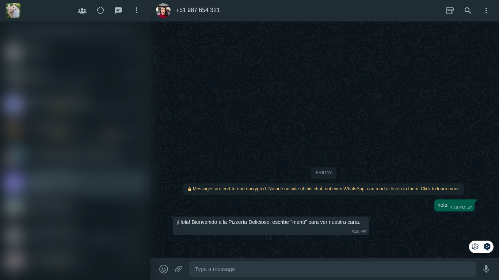

# Buho caso 8

## ChatBot 🤖🤖 ( 🔨 En desarrollo 🔨)






## Instalación

### Requisitos:
* Tener instalado [Node JS → ](https://nodejs.org/es)
* Tener instalado [GIT → ](https://git-scm.com/) Opcional

### Pasos:

#### 1: Para instalar el proyecto puedes usar git. En tu terminal de gitbash usa el siguiente comando 👉 ```git clone "https://github.com/1TSpahc/Buho-caso-8.git"```.
#
#### 2: Ahora que ya tenemos clonado este repositorio en nuestra maquina tenemos que ingresar a la carpeta de nuestro proyecto usando el siguiente comando 👉 ```cd Buho-caso-8```.
#

#### 3: Ya adentro de nuestra carpeta usaremos el comando de NodeJS 👉 ```npm install``` para instalar todas las dependencias que necesita nuestro proyecto para funcionar. 
#

#### 4: Como ultimo paso ejecutaremos nuestro proyecto con el siguiente comando de nodeJS 👉 ```npm run dev```, ahora que nuestro proyecto esta corriendo es momento de ingresar a 👉 ```http://localhost:4000``` para ver nuestra interfaz y escanear el qr
#
### Funcionamiento de nuestra app

#### Al entrar a ```http://localhost:4000``` lo primero es escanear el codigo qr.


#### Lo segundo es elegir una plantilla.


#### Al darle en ```usar esta plantilla``` ya estarias usando tu numero de wsp como bot.





